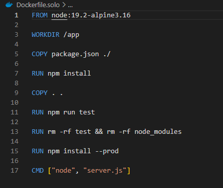
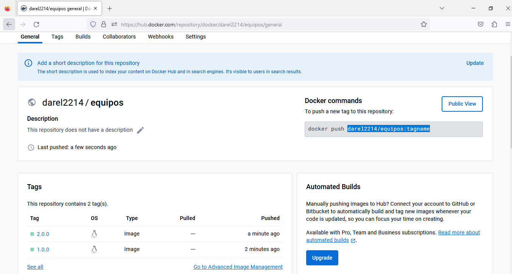
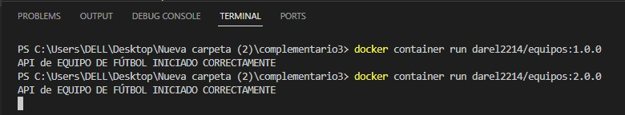
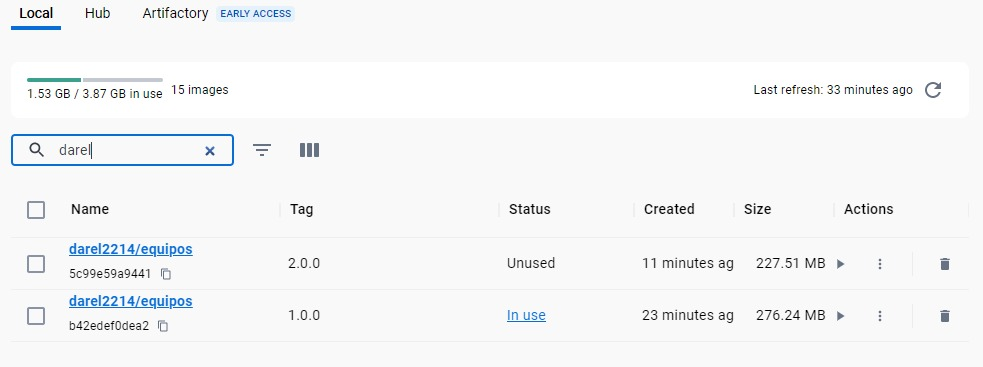
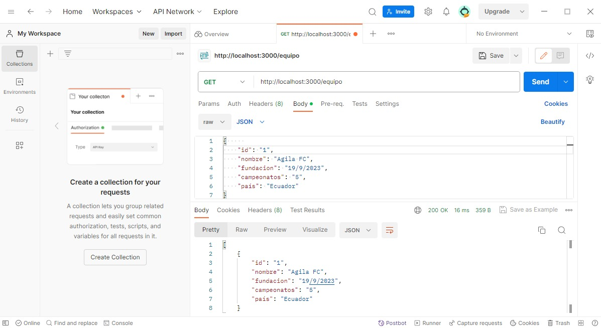
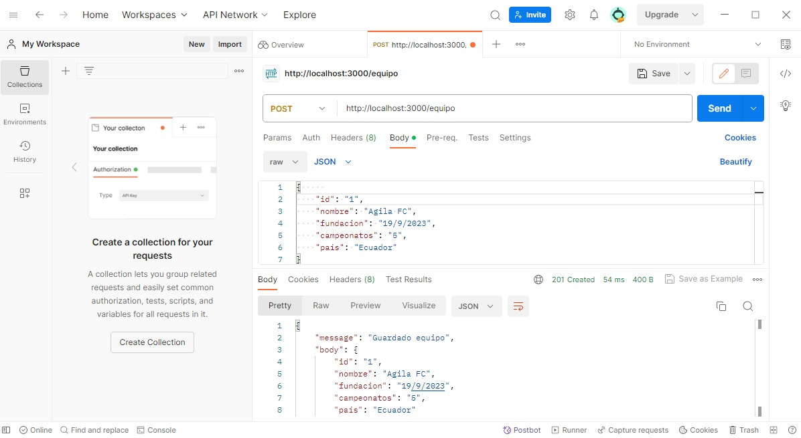
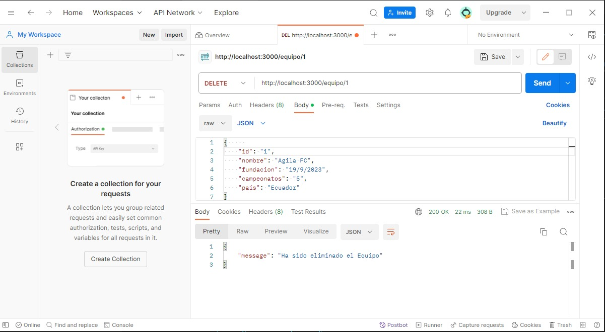
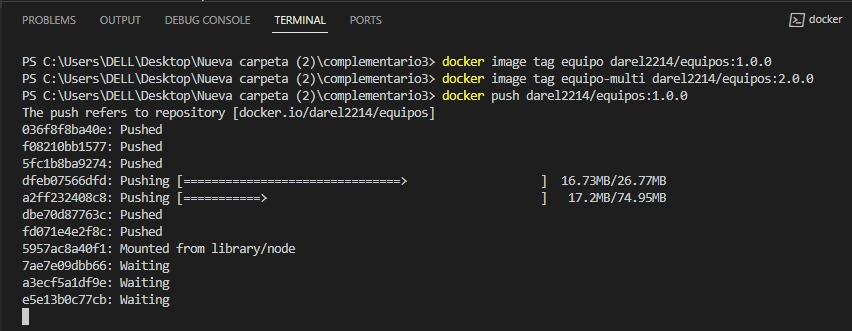

# PRÁCTICA 3

  
Trabajo realizado por:
 
- Baque Lopez Dayanna Nicole
 
- Blondet Intriago Vianny Darel
 
- Campozano Figueroa Enrique Josué
 
- Macias Mosquera Elian Joshue

  
Evidencia de la práctica

## Dockerfile.test del proyecto

## Dockerfile multistages del proyecto

## Imagenes publicadas en docker hub

## Ejecucion del docker desde imagen subida a docker hub

## Docker corriendo

## App corriendo (Documentacion del API REST)
## Metodo GET

## Metodo POST

## DELETE

## Creando los tag de los docker

##  Subir a la nube 

## Ejecucion de los tags de la nube en máquinas local 

