# PRÁCTICA 4

  
Trabajo realizado por:
 
- Baque Lopez Dayanna Nicole
 
- Blondet Intriago Vianny Darel
 
- Campozano Figueroa Enrique Josué
 
- Macias Mosquera Elian Joshue

  
Evidencia de la práctica

## Punto 1

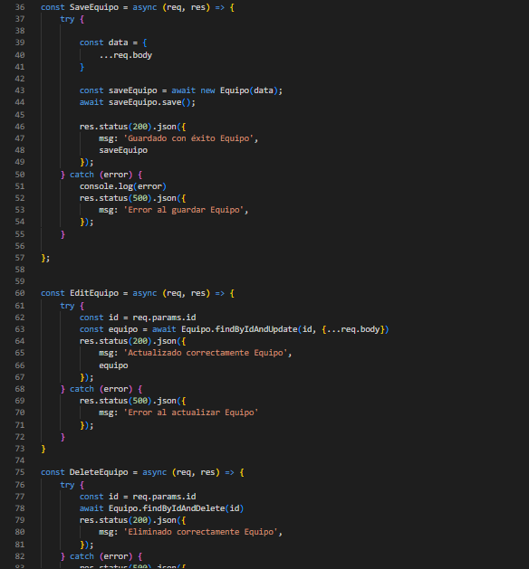

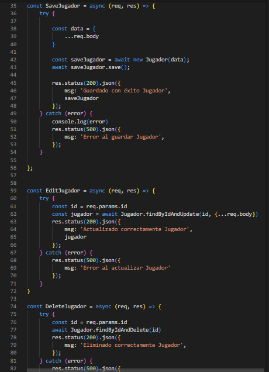

## Punto 2

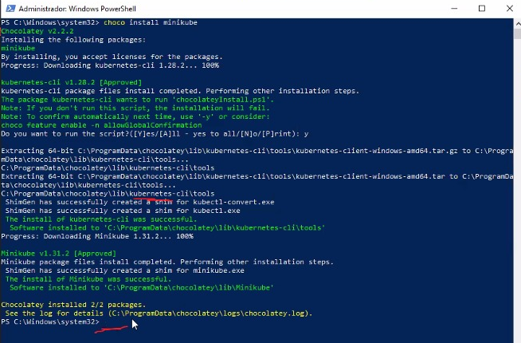

## Punto 3

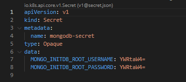

## Punto 4

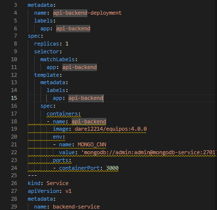

## Punto 5

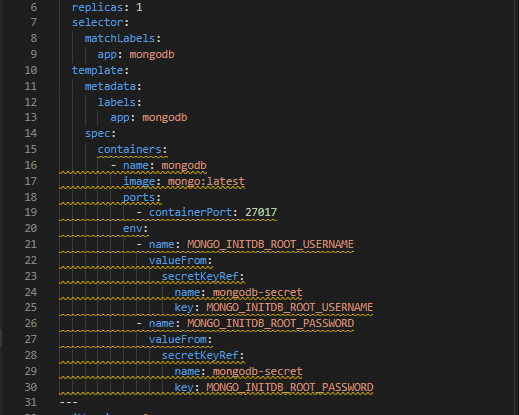

## Punto 6
## a
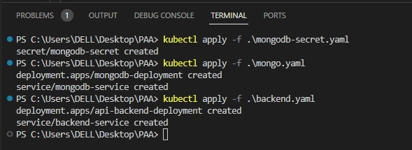

## b
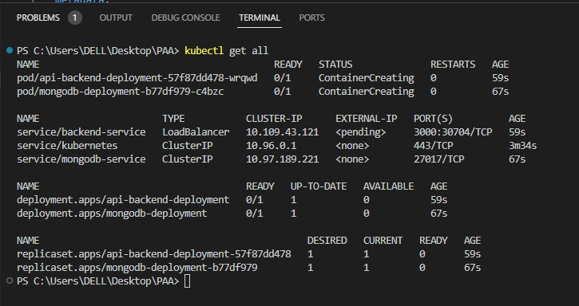

## c
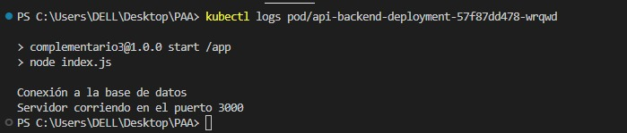

## e

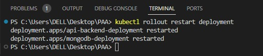

##  f

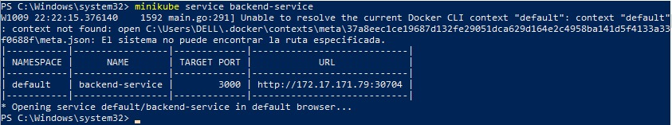

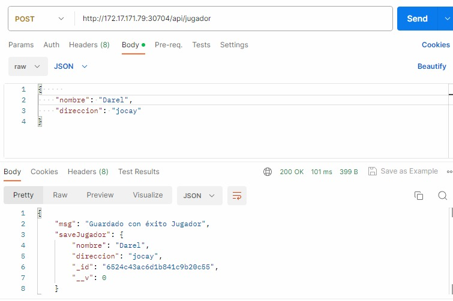

## g

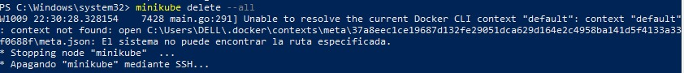

##
## RECOMENDACIONES ADICIONALES
# Para la realización de la Practica N4 se necesito de documentación para resolver problemas que dieron durante la misma, como los siguientes:

# Permisos todos los script

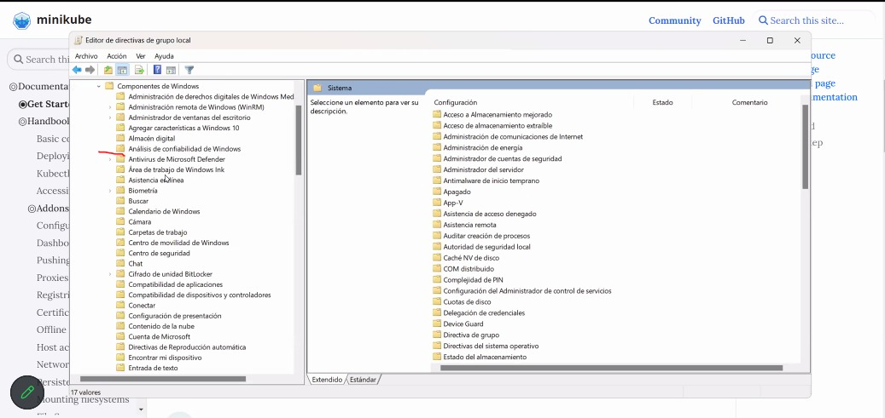

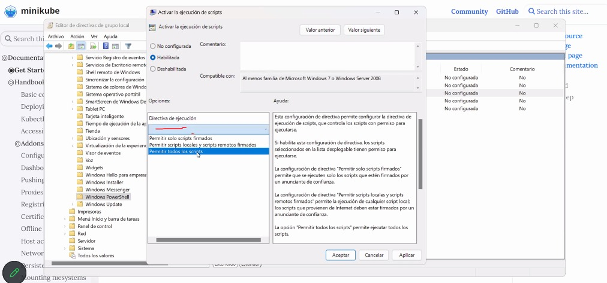

# Para iniciar el minikube se recomienda cerrar el docker para que no de problermas (nuevas actualizaciones)

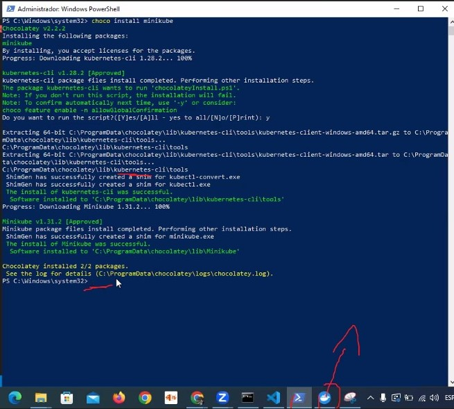

